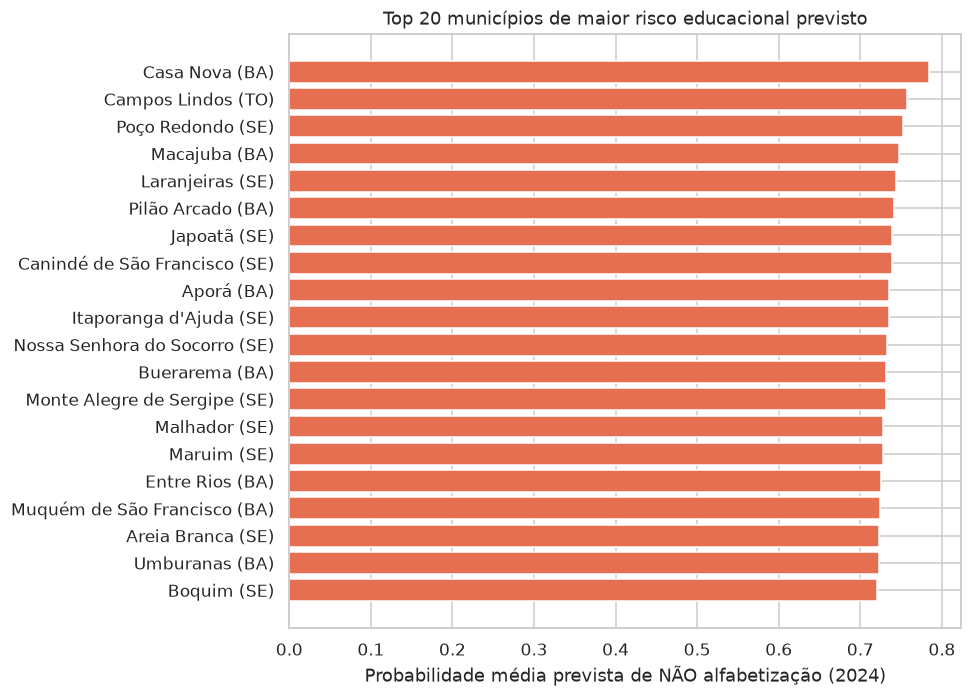
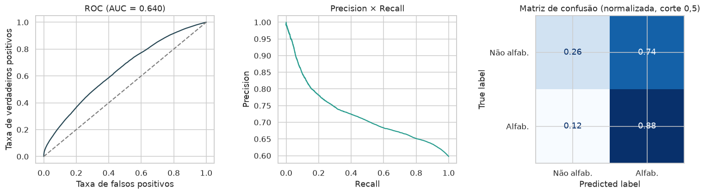
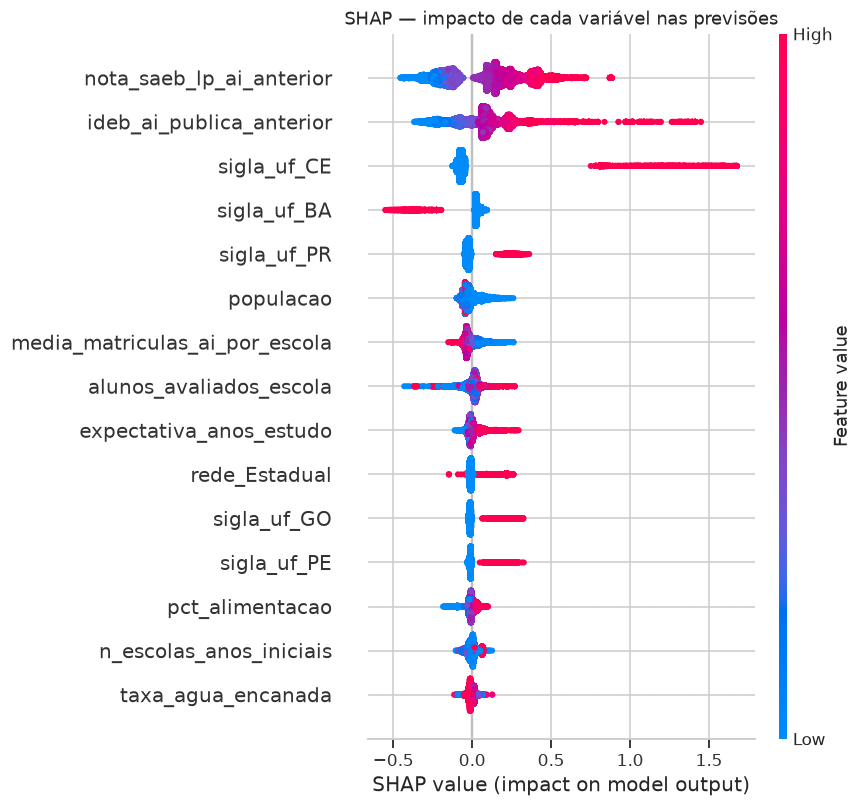

# Tech Challenge — Fase 3
## Predição e Inteligência Analítica para Alfabetização no Brasil

Modelo supervisionado que prevê se um aluno do 2º ano do fundamental será
considerado **alfabetizado ou não**, construído sobre a camada Gold da Fase 2 e
enriquecido com variáveis educacionais, territoriais e socioeconômicas — e a
transformação dessas previsões em inteligência acionável para gestores públicos.



---

## 1. Contexto do problema

O *Compromisso Nacional Criança Alfabetizada* fixou a meta de que toda criança
brasileira esteja alfabetizada ao fim do 2º ano do fundamental até 2030. O
**Indicador Criança Alfabetizada** (INEP) mede o percentual de estudantes que
atingem 743 pontos na escala Saeb de Língua Portuguesa. Em 2024, cerca de 41%
dos alunos avaliados ainda não atingiam esse patamar, com desigualdade
territorial profunda.

Para o gestor público, o dado oficial chega **depois** do ano letivo. A pergunta
deste projeto: com o que se sabe **antes** da avaliação (histórico da rede,
território, contexto socioeconômico, infraestrutura escolar), é possível
antecipar onde o risco se concentra e agir a tempo?

## 2. Objetivo analítico

1. Treinar um **classificador binário** no grão aluno (alvo: `alfabetizado`),
   usando apenas informação disponível antes da avaliação;
2. Validar a capacidade de **generalização temporal** (treinar em 2023, prever
   2024);
3. Explicar **quais fatores** movem as previsões (Feature Importance + SHAP);
4. Converter as previsões em **instrumentos de gestão**: ranking municipal de
   risco, famílias de municípios com padrões semelhantes e lista de municípios
   em risco de não atingir as metas pactuadas.

## 3. Base utilizada

A base de modelagem nasce **na camada Gold** do BigQuery da Fase 2
(`gold.gold_base_ml_alunos`, materializada por
[`src/preprocessing/build_dataset.py`](src/preprocessing/build_dataset.py)):

- **3.355.846 alunos** avaliados e presentes (1.503.058 em 2023 e 1.852.788 em
  2024), com o alvo `alfabetizado` (59,1% sim × 40,9% não);
- **Origem principal:** microdados da Avaliação da Alfabetização (INEP), via
  pipeline Bronze → Silver → Gold da Fase 2 (dbt, 47 testes de qualidade);
- **Enriquecimento externo** (Base dos Dados / BigQuery):
  - *Censo Escolar (INEP)* — infraestrutura escolar agregada por município
    (13 indicadores: internet, biblioteca, saneamento, urbanização, porte);
  - *IBGE* — população municipal e PIB per capita do ano anterior;
  - *Atlas do Desenvolvimento Humano (2010)* — IDHM e subíndices, Gini, renda,
    pobreza infantil, analfabetismo adulto (12 indicadores);
  - *IDEB (INEP)* — anos iniciais da rede pública, **edição anterior** ao ano
    avaliado (2021 → alunos de 2023; 2023 → alunos de 2024).

Dicionário completo, cobertura dos joins e decisões de construção:
[`reports/base_analitica.md`](reports/base_analitica.md).

**Fatos de cobertura documentados:** a avaliação cobre essencialmente a rede
pública (a rede privada aparece com 24 alunos residuais); **Roraima não possui
dados divulgados** em nenhum dos dois anos; 1.185 alunos chegam sem peso
amostral; o `id_escola` é **anonimizado** pelo INEP (join com o Censo Escolar
por escola é impossível — testado, zero casamento — por isso o enriquecimento
escolar é municipal).

## 4. Etapas de modelagem

Análise exploratória completa em
[`notebooks/01_eda.ipynb`](notebooks/01_eda.ipynb) (distribuições, correlações,
desigualdade territorial, hipóteses analíticas que guiaram a modelagem).

A pipeline de ML ([`src/preprocessing/pipeline.py`](src/preprocessing/pipeline.py)
e [`src/modeling/train.py`](src/modeling/train.py)) é um `Pipeline` do
Scikit-learn com o pré-processamento **integrado ao modelo**:

| Etapa | Técnica | Observação |
|---|---|---|
| Imputação (numéricas) | `SimpleImputer(strategy="median")` | Mediana: robusta às caudas longas de população, PIB e renda |
| Transformação numérica | `StandardScaler` | Aplicada quando o estimador precisa (modelo linear) |
| Encoding (categóricas) | `OneHotEncoder(handle_unknown="ignore")` | `rede`, `regiao`, `sigla_uf`; categoria nova não derruba o modelo |
| Integração | `ColumnTransformer` dentro do `Pipeline` | `fit` das transformações acontece **sempre e somente** no treino de cada split, por construção |

**Tratamento de data leakage** (decisões explícitas, verificadas na base):

1. `proficiencia` **nunca** entra como feature — o alvo é literalmente
   `proficiencia >= 743`;
2. Alunos **ausentes** ficam fora do treino: chegam com `alfabetizado = 0`
   preenchido de fábrica, mas isso é artefato, não medição;
3. Nenhum agregado de alfabetização do **mesmo ano** entra como feature (a taxa
   municipal de 2024 foi calculada com os mesmos alunos que o modelo tenta
   prever); contexto educacional vem sempre de edições **anteriores**;
4. `id_municipio` e `id_escola` são chaves de grupo, **não** features
   (alta cardinalidade = decorar território);
5. Validações agrupadas por município (`StratifiedGroupKFold`): alunos do mesmo
   município nunca ficam em treino e validação simultaneamente.

**Protocolo de validação:**

- **Avaliação principal — split temporal:** treina em 2023, testa em 2024
  (o cenário real de uso);
- Comparação de candidatos e busca de hiperparâmetros
  (`RandomizedSearchCV`, 12 × 3 folds agrupados) em subamostra agrupada de
  ~400 mil alunos; campeão re-treinado na base completa de 2023;
- Replicabilidade: semente fixa (42) em tudo, ambiente em
  [`requirements.txt`](requirements.txt), treino reprodutível com um comando.

## 5. Escolha do algoritmo

| Modelo | ROC-AUC (CV agrupada) |
|---|---|
| Baseline (classe majoritária) | 0,500 |
| Regressão Logística | 0,641 ± 0,018 |
| Random Forest | 0,649 ± 0,020 |
| LightGBM (padrão) | 0,642 ± 0,013 |
| **LightGBM otimizado** | **0,654** |

Os três modelos reais empatam tecnicamente antes do tuning. O **LightGBM
otimizado** assume a frente e foi escolhido também pelo critério operacional:
treina em minutos na base completa (1,5 mi de linhas) com memória modesta. Os
hiperparâmetros vencedores são conservadores (`num_leaves=31`, `reg_lambda=5`,
subamostragem de linhas e colunas) — regularização contra overfitting.

## 6. Métricas de avaliação

Avaliação temporal (treinou em 2023, previu 2024 — dados nunca vistos):

| Métrica (teste 2024) | Simples | Ponderada pelo peso amostral |
|---|---|---|
| ROC-AUC | **0,640** | 0,639 |
| Acurácia | 0,632 | 0,630 |
| F1 (alfabetizado) | 0,703 | 0,701 |
| Precision / Recall (alfabetizado) | 0,66 / 0,75 | 0,66 / 0,75 |
| Brier score | 0,225 | 0,226 |

Gap treino (0,688) × teste (0,640) = **0,048**: overfitting contido.



O notebook 02 traz também a **tabela de cortes de decisão**: tratando o modelo
como triagem, baixar o corte aumenta o recall da classe "não alfabetizado"
(capturar mais crianças em risco) ao custo de mais sinalizações — o trade-off é
uma escolha do gestor, não do algoritmo.

## 7. Interpretação dos resultados

Permutation importance (na pipeline, sobre o teste de 2024) + SHAP
([`notebooks/03_interpretabilidade.ipynb`](notebooks/03_interpretabilidade.ipynb)):

1. **UF é o fator dominante** (queda de AUC 0,030 ao embaralhar) — as
   diferenças estaduais de política de alfabetização e regime de colaboração
   pesam mais que o nível socioeconômico municipal;
2. **Histórico educacional recente da rede** — nota Saeb de Língua Portuguesa
   (0,024) e IDEB dos anos iniciais (0,010) da edição anterior;
3. **Rede (municipal × estadual) e porte** (população, tamanho da escola);
4. **Socioeconômico e infraestrutura diluídos** na importância marginal
   (≈0,001 cada): UF e IDEB já carregam boa parte dessa informação
   (colinearidade). A EDA mostra a correlação municipal clara — seguem
   relevantes para diagnóstico, não como preditores marginais.



## 8. Insights encontrados

- **O risco é previsível antes da prova:** o ranking municipal previsto
  (fora-da-amostra) acompanha fortemente o resultado real de 2024 —
  **Spearman −0,76** entre risco previsto e taxa observada;
- **A desigualdade é estrutural e mapeável:** 3 famílias de municípios
  (clustering KMeans) com perfis nítidos; a família crítica concentra baixo
  IDHM, alta pobreza infantil, histórico educacional fraco e é majoritariamente
  Norte/Nordeste;
- **As metas de 2025 já nascem em risco em 59% dos municípios avaliáveis:**
  1.699 de 2.873 municípios (com ≥100 alunos avaliados) têm performance
  prevista abaixo da meta pactuada para 2025 — lista nominal por UF em
  [`reports/municipios_risco_meta_2025.csv`](reports/municipios_risco_meta_2025.csv);
- **Política estadual importa mais que renda:** o peso da UF sobre todos os
  demais fatores sugere que arranjos estaduais estruturados de alfabetização
  são a alavanca mais poderosa observável nos dados.

## 9. Limitações do projeto

- **Features exclusivamente contextuais:** a base pública não traz atributos
  individuais do aluno (nível socioeconômico familiar, frequência, trajetória
  escolar). Modelos de desfecho individual com features só de contexto têm teto
  natural de AUC — o valor está em **ordenar risco**, não em acertar cada
  criança;
- **Apenas duas edições** da avaliação (2023, 2024): a validação temporal tem
  um único salto; a estabilidade em horizontes maiores é hipótese;
- **Sem cruzamento por escola:** `id_escola` anonimizado impede usar a
  infraestrutura da escola específica (fica o agregado municipal);
- **Roraima ausente** da base em ambos os anos;
- A comparação com metas usa a coorte prevista de 2024 como estimativa da
  capacidade corrente da rede — não é uma projeção causal de 2025;
- Correlação ≠ causa: o modelo prioriza, não substitui avaliação de impacto.

## 10. Aplicação prática para políticas públicas

- **Focalização:** o ranking de risco
  ([`reports/ranking_risco_municipal.csv`](reports/ranking_risco_municipal.csv))
  permite priorizar apoio técnico, formação de alfabetizadores e recomposição
  de infraestrutura **durante** o ano letivo, sem esperar a divulgação oficial;
- **Alerta de metas:** a lista de municípios previstos abaixo da meta de 2025
  aponta onde o Compromisso corre risco — por UF e com o tamanho do gap;
- **Desenho de política:** as 3 famílias de municípios pedem estratégias
  diferentes (a família crítica exige ação socioeducacional combinada; a
  intermediária, replicação de práticas; a consolidada, manutenção);
- **Transferência de prática:** o peso da UF indica que estudar e replicar os
  arranjos dos estados que performam acima do esperado tende a render mais que
  intervenções isoladas de infraestrutura.

## 11. Possíveis evoluções futuras

- Re-treinar a cada edição (2025+) e medir a estabilidade do ranking;
- Nível socioeconômico do INEP (INSE) por escola, se o INEP publicar chave
  cruzável;
- Modelo hierárquico (aluno dentro de escola dentro de município) para separar
  efeito-rede de efeito-território;
- Calibração das probabilidades (isotônica) para uso direto como score de risco;
- Painel interativo (Streamlit/Looker) sobre os CSVs de `reports/`;
- Automatizar o fluxo completo (ingestão → treino → relatórios) com
  orquestração e alerta, aproveitando a base GCP da Fase 2.

---

## Estrutura do repositório

```
tech-challenge-fase3/
├── data/                    # parquets locais (gitignorados; gerados pelo build)
├── notebooks/
│   ├── 01_eda.ipynb                  # análise exploratória e hipóteses
│   ├── 02_modelagem.ipynb            # pipeline, comparação, tuning, avaliação
│   ├── 03_interpretabilidade.ipynb   # permutation importance + SHAP
│   └── 04_aplicacao_estrategica.ipynb# 5 perguntas de negócio
├── src/
│   ├── preprocessing/
│   │   ├── build_dataset.py  # materializa a base na Gold e exporta parquet
│   │   └── pipeline.py       # pré-processamento integrado (ColumnTransformer)
│   ├── modeling/train.py     # comparação, tuning, treino final, predições
│   ├── evaluation/           # (avaliação nos notebooks 02-03)
│   └── visualization/        # (gráficos nos notebooks)
├── reports/                  # documentação técnica, métricas e CSVs acionáveis
├── images/                   # gráficos exportados dos notebooks
├── requirements.txt
└── README.md
```

## Como executar

Pré-requisitos: Python 3.12, [uv](https://docs.astral.sh/uv/), e (apenas para
reconstruir a base) `gcloud` autenticado no projeto da Fase 2.

```bash
uv venv && uv pip install -r requirements.txt

# 1. Reconstrói a base analítica na camada Gold e exporta os parquets
uv run python src/preprocessing/build_dataset.py

# 2. Treina, valida e gera métricas + predições (semente fixa)
uv run python -m src.modeling.train

# 3. Notebooks (ordem 01 → 04)
uv run jupyter lab notebooks/
```

## Vídeo executivo

Roteiro em [`reports/roteiro_video_executivo.md`](reports/roteiro_video_executivo.md);
link do vídeo: *(adicionar após a gravação)*.
